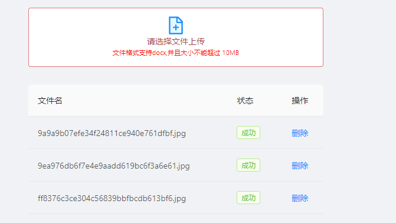

# 本组件实现了以下两个功能

1. 图片墙， 文件列表的展示
2. 支持上传图片和上传文件,删除图片,删除文件，通过axios进行操作

# Api
| 参数 | 说明 | 类型     | 默认值 |
| --- | --- | -----| ---|
| maxCount | 当超过最大上传数量的时候，就不能上传| number | Infinity|
| type | 表示上传的是图片还是文件 |   PICTURE:0, FILE:1 (type为0表示图片，为1表示文件) | 1 |
| readOnly | 表示是否可以更改, true表示只读，false表示可以更改 |  Boolean | false
| fileList | 文件列表 | Array | [ ] |
| onRemove | 删除文件时的操作 | Func(file, res) | / |
| onUpload | 上传文件后的结果 | Func(res) | / |

# 说明
## type

当 type 为 1 时

当 type 为 0 时

## maxCount
并且文件数量不能超过maxCount，文件数量等于maxCount时，上传图标会消失

