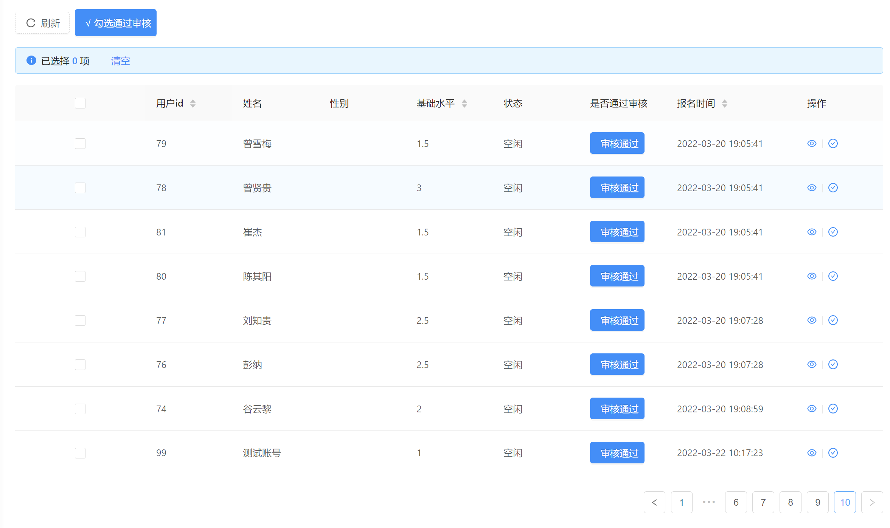
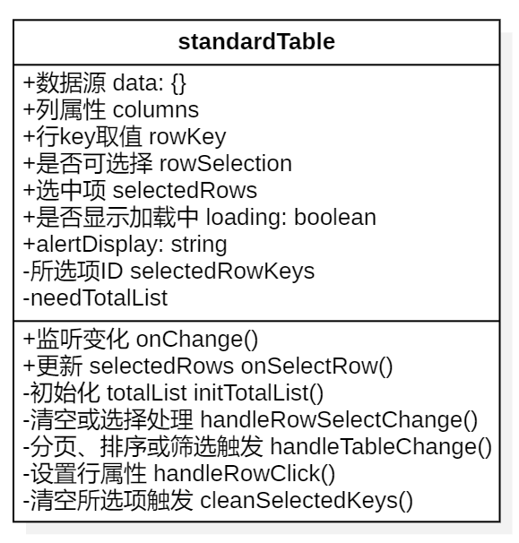

# 组件说明

本组件实现了以下功能，结合antd的Table组件

1. 实现了根据数据源自动生成带有排序功能的表格
2. 实现了数据分页、多选处理和数据操作的功能

效果图如下所示：



# 输入参数

| 参数名称     | 是否必须 | 类型              | 说明                                      | 默认值 |
| ------------ | -------- | ----------------- | ----------------------------------------- | ------ |
| data         | 必须     | Object            | 指定表格的数据源                          |        |
| columns      | 必须     | Array             | 表格列的配置描述                          |        |
| rowKey       | 必须     | String \|function | 表格行 key 的取值，可以是字符串或一个函数 |        |
| onChange     | 必须     | function          | 分页、排序、筛选变化时触发                |        |
| rowSelection | 可选     | Object            | 表格行是否可选择                          |        |
| onSelectRow  | 可选     | function          | 更新selectedRows                          |        |
| selectedRows | 可选     | Array             | 父组件表格中的选中项                      |        |
| loading      | 可选     | Boolean           | 页面是否加载中                            |        |
| alertDisplay | 可选     | String            | rowSelection为null时，设置表格样式        |        |

组件类图如下所示：



详情可参考 [antd官方文档](https://ant.design/docs/react/getting-started-cn)

# 完整的参考实例

注：在父组件render中调用

其中：

1. data是对象类型，属性分别为数据信息和分页信息。

```javascript
 const data = {
	list: RuleData,
	pagination:{
      total: 0, //数据总条数
      pageNum: 1, //位于第几页数据
      pageSize: 10, //一页数据多少条
    }
};
```

2. columns为数组类型：

```JavaScript
  const columns = [
      {
        title: '序号',
        key: 'index', //必选
        dataIndedx: 'index', //字段名称需和数据源字段名称一致
        width: '5%',
        align: 'center',
        render: (text, record, index) => <span>{index + 1}</span>
      },
      {
        title: '比赛管理',
        key: 'manage',
        dataIndex: 'manage',
        width: '15%',
        align: 'center',
        render: (text, record) => (
          <div>
            <Tooltip title='积分榜'>
              <a onClick={() => this.goHomePageDetail(record)}>
                <Icon type='profile' />
              </a>
            </Tooltip>
          </div>
        )
      }
    ];
```

## 需要实现多选功能时

```JavaScript
<StandardTable
  selectedRows={selectedRows}//由所选择的record组成的对象数组
  onSelectRow={this.handleSelectRows} //触发更新 selectedRows
  loading={listLoading}
  data={data || []}
  columns={columns}
  pagination={playerPagintaion}
  onChange={this.handleStandardTableChange}
  rowKey={record => record.userId}
/>
```

```JavaScript
 handleSelectRows = (val) => {
    this.setState({
      selectedRows: val
    })
  }
```


## 不需要多选功能时

```JavaScript
<StandardTable
  selectedRows={selectedRows}
  onSelectRow={() => { }} //不需要多选功能
  rowSelection={null}
  loading={listLoading}
  data={data}
  columns={columns}
  pagination={pagination}
  onChange={this.handleStandardTableChange}
  rowKey={r => r.id}
/>
```

# 其他信息

> 版本号:1.0
>
> 创建时间:2022/3/23
>
> 创建人:陈梦洁